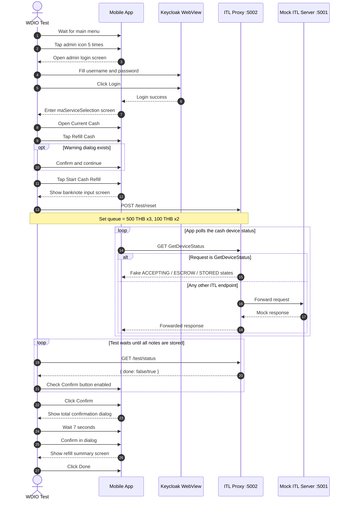
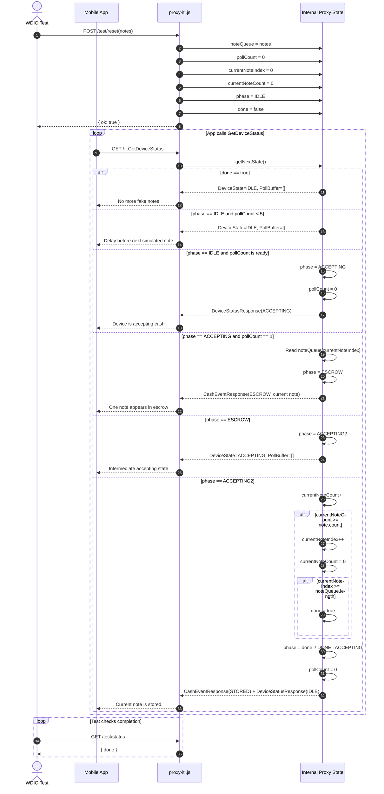

# Admin Refill Cash Sequence

This document describes the `admin.spec.js` refill-cash flow at two levels:

- High-level end-to-end flow across the test, app, proxy, and mock server
- Low-level proxy state transitions used to simulate banknote insertion

## Related Files

- `test/specs/admin.spec.js`
- `test/pageobjects/admin/login.page.js`
- `test/pageobjects/admin/currentcash.page.js`
- `test/pageobjects/main.page.js`
- `test/pageobjects/base.page.js`
- `proxy-itl.js`
- `mock-itl-server.js`

## High-Level Sequence

## Low-Level Proxy Sequence

## Notes

- Values in `proxy-itl.js` are in minor units. `50000` means `500 THB`, and `10000` means `100 THB`.
- `GetDeviceStatus` is intercepted by the proxy. Other device endpoints are forwarded to `mock-itl-server.js`.
- The UI test does not rely on explicit assertions here. Success mostly depends on `waitForDisplayed`, `waitUntil`, and timeout behavior.
